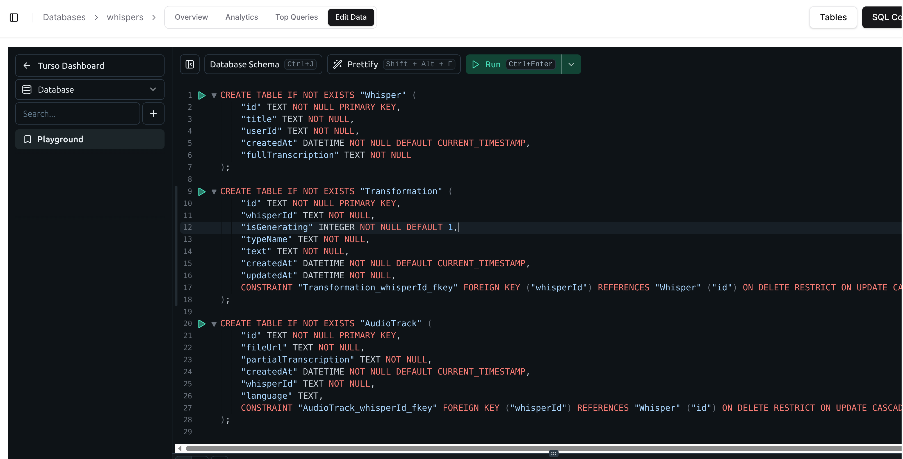
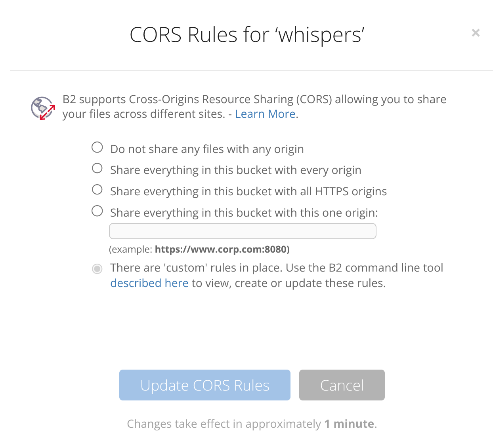
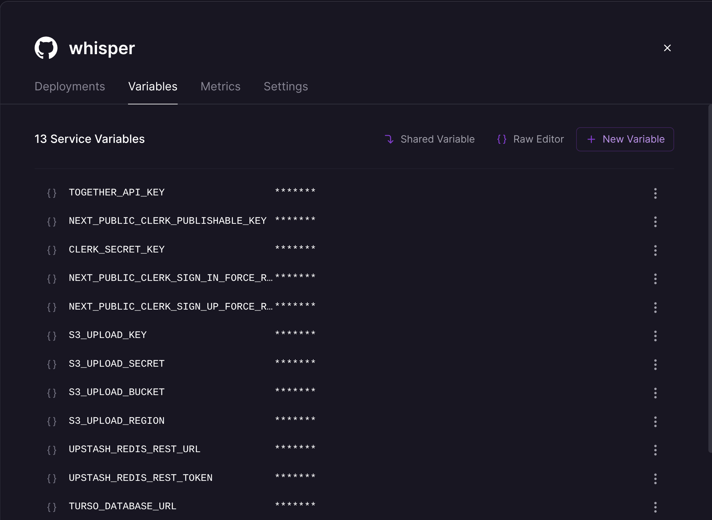

<a href="https://github.com/nutlope/whisper-app">
  
  <h1 align="center">Whisper App</h1>
</a>

<p align="center">
  An open source audio transcription and transformation app. Powered by Together.ai.
</p>

<p align="center">
  <strong>This fork has been migrated to use Railway, Turso, and Backblaze B2</strong>
</p>

<p align="center">
  <em>⚠️ This is a reference implementation for educational purposes. Not actively maintained. Feel free to use as a starting point for your own project.</em>
</p>

---

## Sponsor

<p align="center">
  <a href="https://buttonhealth.ca?utm_source=github&utm_medium=sponsorship">
    
  </a>
</p>

This project is proudly sponsored by **[Button Health](https://buttonhealth.ca?utm_source=github&utm_medium=sponsorship)**.

We are a **Toronto family medicine practice** focused on proactive, OHIP-funded primary care. We support the technology that improves physician workflows and patient outcomes.

[Join our patient priority list.](https://buttonhealth.ca?utm_source=github&utm_medium=sponsorship)

---

## Tech Stack

- **[Together.ai](https://together.ai)** - LLM-powered audio transcription (Whisper) and transformation
- **[Vercel AI SDK](https://sdk.vercel.ai)** - LLM framework
- **[Clerk](https://clerk.com)** - User authentication
- **[Turso](https://turso.tech)** - SQLite database (libSQL) - *Replaces Neon*
- **[Next.js](https://nextjs.org)** v15.2.4 - App Router framework
- **[Backblaze B2](https://www.backblaze.com/b2)** - Object storage for audio files (S3-compatible) - *Replaces AWS S3*
- **[Upstash Redis](https://upstash.com)** - Rate limiting
- **[Prisma](https://prisma.io)** - ORM
- **[Railway](https://railway.app)** - Hosting platform - *Replaces Vercel*
- **[tRPC](https://trpc.io)** - End-to-end typesafe APIs

> **⚠️ Version Note (November 2024)**: This project uses Next.js 15.2.4 and React 19. These are relatively new versions. If you encounter compatibility issues, consider waiting for the ecosystem to mature or pinning to these specific versions until you're ready to upgrade.

## How It Works

1. Create an account on the site with Clerk
2. Upload an audio file, which gets uploaded to Backblaze B2
3. The audio is transcribed using Together.ai's Whisper model
4. Optionally, transform the transcription using LLMs (summarize, extract action items, etc.)
5. View and manage your transcriptions in your dashboard

## Prerequisites

Before you begin, you'll need accounts with the following services:

1. **[Together AI](https://api.together.xyz)** - For Whisper transcription and LLM transformations
2. **[Clerk](https://clerk.com)** - For user authentication
3. **[Turso](https://turso.tech)** - For the database
4. **[Backblaze B2](https://www.backblaze.com/b2)** - For audio file storage
5. **[Upstash](https://upstash.com)** - For Redis rate limiting
6. **[Railway](https://railway.app)** - For deployment

## Quick Start Checklist

Use this checklist to track your setup progress:

- [ ] Clone repository
- [ ] Run `npm install` (not pnpm!)
- [ ] Copy `.env.example` to `.env`
- [ ] Get Together AI API key
- [ ] Set up Clerk application and get keys
- [ ] Create Turso database and run SQL schema
- [ ] Create Backblaze B2 bucket and application key
- [ ] Create Upstash Redis database
- [ ] Copy and configure `b2-cors-rules.example.json` to `b2-cors-rules.json`
- [ ] Run `npm run set-b2-cors` to apply CORS rules
- [ ] Run `npx prisma generate` to create Prisma client
- [ ] Run `npm run dev` to test locally
- [ ] Set up Railway project and add environment variables
- [ ] Deploy with `railway up`
- [ ] Update B2 CORS with production domain

## Local Development Setup

### 1. Clone the Repository

```bash
git clone https://github.com/YOUR_USERNAME/whisper-nutlope-B2-railway-turso.git
cd whisper-nutlope-B2-railway-turso
```

### 2. Install Dependencies

```bash
npm install
```

> **Note**: Use `npm` instead of `pnpm`. Railway deployment requires npm for compatibility.

### 3. Set Up Environment Variables

Copy the example environment file:

```bash
cp .env.example .env
```

Then fill in your actual values in `.env`:

#### Together AI
- Get your API key from [Together AI Settings](https://api.together.xyz/settings/api-keys)
- Add to `.env`: `TOGETHER_API_KEY=your_key_here`

#### Clerk
- Create an application at [Clerk Dashboard](https://dashboard.clerk.com)
- Copy your publishable and secret keys
- Add to `.env`:
  ```
  NEXT_PUBLIC_CLERK_PUBLISHABLE_KEY=pk_test_...
  CLERK_SECRET_KEY=sk_test_...
  ```

#### Turso Database
- Install Turso CLI: `curl -sSfL https://get.tur.so/install.sh | bash`
- Create a database: `turso db create whispers`
- Get the URL: `turso db show whispers --url`
- Create an auth token: `turso db tokens create whispers`
- **Manually create the database schema** (Prisma migrations don't work directly with Turso):
  ```bash
  turso db shell whispers
  ```
  Then paste this SQL:
  ```sql
  CREATE TABLE IF NOT EXISTS "Whisper" (
    "id" TEXT NOT NULL PRIMARY KEY,
    "title" TEXT NOT NULL,
    "userId" TEXT NOT NULL,
    "createdAt" DATETIME NOT NULL DEFAULT CURRENT_TIMESTAMP,
    "fullTranscription" TEXT NOT NULL
  );

  CREATE TABLE IF NOT EXISTS "Transformation" (
    "id" TEXT NOT NULL PRIMARY KEY,
    "whisperId" TEXT NOT NULL,
    "isGenerating" INTEGER NOT NULL DEFAULT 1,
    "typeName" TEXT NOT NULL,
    "text" TEXT NOT NULL,
    "createdAt" DATETIME NOT NULL DEFAULT CURRENT_TIMESTAMP,
    "updatedAt" DATETIME NOT NULL,
    CONSTRAINT "Transformation_whisperId_fkey" FOREIGN KEY ("whisperId") REFERENCES "Whisper" ("id") ON DELETE RESTRICT ON UPDATE CASCADE
  );

  CREATE TABLE IF NOT EXISTS "AudioTrack" (
    "id" TEXT NOT NULL PRIMARY KEY,
    "fileUrl" TEXT NOT NULL,
    "partialTranscription" TEXT NOT NULL,
    "createdAt" DATETIME NOT NULL DEFAULT CURRENT_TIMESTAMP,
    "whisperId" TEXT NOT NULL,
    "language" TEXT,
    CONSTRAINT "AudioTrack_whisperId_fkey" FOREIGN KEY ("whisperId") REFERENCES "Whisper" ("id") ON DELETE RESTRICT ON UPDATE CASCADE
  );
  ```
  

- Add to `.env`:
  ```
  TURSO_DATABASE_URL=libsql://your-database.turso.io
  TURSO_AUTH_TOKEN=your_token_here
  ```

#### Backblaze B2
- Create a B2 account at [Backblaze](https://www.backblaze.com/b2)
- Create a bucket (e.g., "whispers")
- Create an application key with read/write access
- Note your region (e.g., "us-west-002")
- Add to `.env`:
  ```
  S3_UPLOAD_KEY=your_key_id
  S3_UPLOAD_SECRET=your_application_key
  S3_UPLOAD_BUCKET=your-bucket-name
  S3_UPLOAD_REGION=us-west-002
  ```

#### Upstash Redis
- Create a Redis database at [Upstash Console](https://console.upstash.com/redis)
- Copy the REST URL and token
- Add to `.env`:
  ```
  UPSTASH_REDIS_REST_URL=https://your-redis.upstash.io
  UPSTASH_REDIS_REST_TOKEN=your_token_here
  ```

### 4. Configure Backblaze B2 CORS

B2 needs CORS configuration to allow uploads from your domain:

```bash
# Copy the example CORS rules
cp b2-cors-rules.example.json b2-cors-rules.json

# Edit b2-cors-rules.json and replace "https://your-domain.com" with your actual domain
# For local development, the localhost entries are already included

# Apply CORS rules using the S3-compatible API
npm run set-b2-cors
```



### 5. Set Up the Database

```bash
# Generate Prisma client (this creates the client in lib/generated/prisma)
npx prisma generate
```

> **Note**: The Prisma client is generated to `lib/generated/prisma` instead of the default location. This is configured in `prisma/schema.prisma`.

> **Important**: `prisma db push` won't work with Turso. You must manually create the schema using the SQL commands in step 3 above.

### 6. Run the Development Server

```bash
npm run dev

```

Open [http://localhost:3000](http://localhost:3000) in your browser.

## Deployment to Railway

### 1. Install Railway CLI

```bash
npm i -g @railway/cli
```

### 2. Login to Railway

```bash
railway login
```

### 3. Initialize Project

```bash
railway init
```

### 4. Add Environment Variables

Add all your environment variables from `.env` to Railway:

```bash
railway variables set TOGETHER_API_KEY=your_key_here
railway variables set CLERK_SECRET_KEY=your_key_here
# ... add all other variables
```

Or use the Railway dashboard to add them via the UI.



### 5. Deploy

```bash
railway up
```

Railway will automatically detect your Next.js app and deploy it using the `nixpacks.toml` configuration.

### 6. Update CORS Configuration

After deployment, update your B2 CORS rules with your Railway domain:

1. Add your Railway URL to `b2-cors-rules.json`
2. Run `npm run set-b2-cors` again
3. Or set `NEXT_PUBLIC_APP_URL` in Railway and the script will use it automatically

## Project Structure

```
├── app/                    # Next.js app directory
│   ├── api/               # API routes
│   └── whispers/          # Whisper pages
├── components/            # React components
├── lib/                   # Utility functions and clients
├── prisma/               # Database schema
├── public/               # Static assets
├── scripts/              # Utility scripts (B2 CORS setup)
├── trpc/                 # tRPC router and client
├── .env.example          # Environment variables template
├── b2-cors-rules.example.json  # CORS configuration template
└── nixpacks.toml         # Railway build configuration
```

## Available Scripts

- `npm run dev` - Start development server with Turbopack
- `npm run build` - Generate Prisma client and build for production
- `npm start` - Start production server
- `npm run studio` - Open Prisma Studio (database GUI)
- `npm run db:push` - Push Prisma schema changes (local dev only)
- `npm run set-b2-cors` - Apply CORS rules to B2 bucket
- `npm run get-b2-cors` - View current B2 CORS rules

> **Railway Note**: Railway automatically runs `npm install`, `npm run build`, and `npm start` as configured in `nixpacks.toml`. Do not use pnpm commands in Railway.

## Troubleshooting

### CORS Errors with B2

If you're getting CORS errors when uploading files:

1. Verify your `b2-cors-rules.json` includes your domain
2. Run `npm run set-b2-cors` to apply the rules
3. Check current rules with `npm run get-b2-cors`
4. Make sure `NEXT_PUBLIC_APP_URL` is set in your `.env`

### Turso Connection Issues

If you can't connect to Turso:

1. Verify your `TURSO_DATABASE_URL` and `TURSO_AUTH_TOKEN` are correct
2. Check your database exists: `turso db list`
3. Test connection: `turso db shell whispers`

### Railway Deployment Issues

If deployment fails:

1. Check all environment variables are set in Railway
2. Verify `nixpacks.toml` is present in your repo
3. Check Railway logs: `railway logs`
4. Ensure you're using npm (not pnpm) - Railway uses the lockfile to detect package manager
5. Verify Prisma client generation runs during build: check that `prisma generate` is in the build script
6. Make sure `TURSO_DATABASE_URL` and `TURSO_AUTH_TOKEN` are set correctly

### Rate Limiting Not Working

If rate limiting isn't working:

1. Verify Upstash Redis credentials are correct
2. Test connection in Upstash console
3. Check Redis is accessible from your deployment

## Migration Notes

This fork has been migrated from the original stack:

- **Vercel → Railway**: For more flexible hosting and better pricing no surprise billing overages
- **Neon → Turso**: For edge-native SQLite with better performance, free for small projects and easier implementation
- **AWS S3 → Backblaze B2**: For cost-effective object storage with S3 compatibility

All functionality remains the same, but the infrastructure is more cost-effective and easier to host.

### Known Issues & Fixes

#### next-s3-upload Compatibility
The original `next-s3-upload` package has compatibility issues with Backblaze B2. The S3 upload functionality has been rewritten to use the AWS SDK directly (`@aws-sdk/client-s3` and `@aws-sdk/s3-request-presigner`). See [this issue](https://github.com/stonith404/pingvin-share/issues/798) for more details.

#### Turso Database Schema
Prisma migrations don't work directly with Turso's libSQL. You must manually create the database schema using the SQL commands provided in the setup instructions above. The `prisma db push` command only works with the local SQLite file (`prisma/dev.db`), not with Turso.

#### Package Manager
Railway requires npm for deployment. Do not use pnpm or yarn. The `nixpacks.toml` configuration explicitly uses npm commands.

### Important Configuration Notes

#### Prisma Client Location
The Prisma client is generated to `lib/generated/prisma` instead of the default `node_modules/.prisma/client`. This is configured in `prisma/schema.prisma`:
```prisma
generator client {
  provider = "prisma-client-js"
  output   = "../lib/generated/prisma"
}
```

#### Environment Variables in Railway
Make sure to set `NEXT_PUBLIC_APP_URL` in Railway to your deployed domain. This is used for:
- CORS configuration in B2
- Clerk redirect URLs
- Any other domain-specific functionality

#### B2 Bucket Configuration
Your B2 bucket must be:
- Set to "Public" if you want direct file access
- Have CORS rules configured (use the provided scripts)
- Use S3-compatible API (not the native B2 API)

#### Local Development Database
For local development, the app uses a SQLite file at `prisma/dev.db`. This is separate from your production Turso database. Don't commit this file (it's in `.gitignore`).

## Helpful Tips

### Cost Optimization
- **Turso**: Free tier includes 500 databases, 9GB storage, 1B row reads/month
- **Backblaze B2**: First 10GB storage free, $0.005/GB after that (much cheaper than S3)
- **Upstash Redis**: Free tier includes 10K commands/day
- **Railway**: $5/month for hobby plan with $5 usage credit
- **Together AI**: Pay-as-you-go pricing for Whisper API

### Development Tips
1. Use the local SQLite database (`prisma/dev.db`) for development
2. Test B2 uploads locally before deploying
3. Use `npm run studio` to inspect your local database
4. Check B2 CORS rules with `npm run get-b2-cors` if uploads fail
5. Railway logs are your friend: `railway logs --follow`

### Security Best Practices
- Never commit `.env` file
- Rotate API keys regularly
- Use Clerk's test keys for development
- Set up proper CORS rules (don't use `*` in production)
- Keep your B2 bucket private and use presigned URLs

### Common Gotchas
- **Railway uses npm**: Don't use pnpm commands or lockfiles
- **Turso needs manual schema**: Can't use `prisma migrate` or `prisma db push`
- **B2 CORS must be set**: Uploads will fail without proper CORS configuration
- **Prisma client location**: Generated to `lib/generated/prisma`, not default location
- **Next.js 15 + React 19**: Newer versions, some packages may have compatibility issues

## About This Fork

This is a reference implementation showing how to migrate the original Whisper app to a more cost-effective stack. It's provided as-is for educational purposes and as a starting point for your own projects.

**Not actively maintained** - Feel free to fork and adapt to your needs!

## License

See [LICENSE](LICENSE) file for details.

## Acknowledgments

- Original project by [Nutlope](https://github.com/nutlope/whisper-app)
- Powered by [Together.ai](https://together.ai) for Whisper transcription
